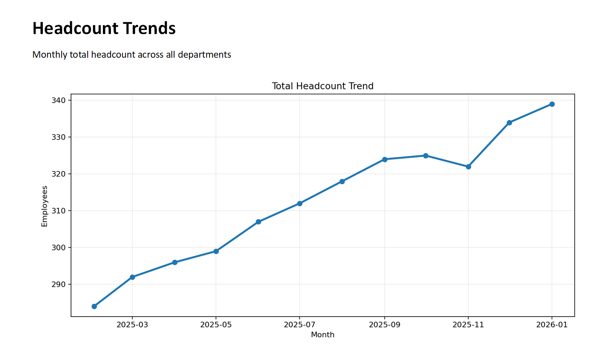
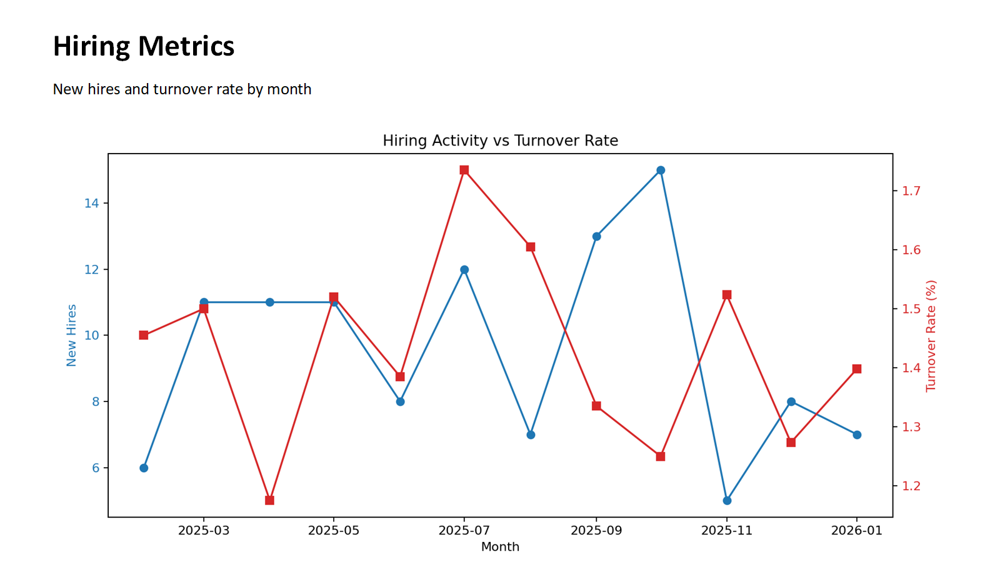
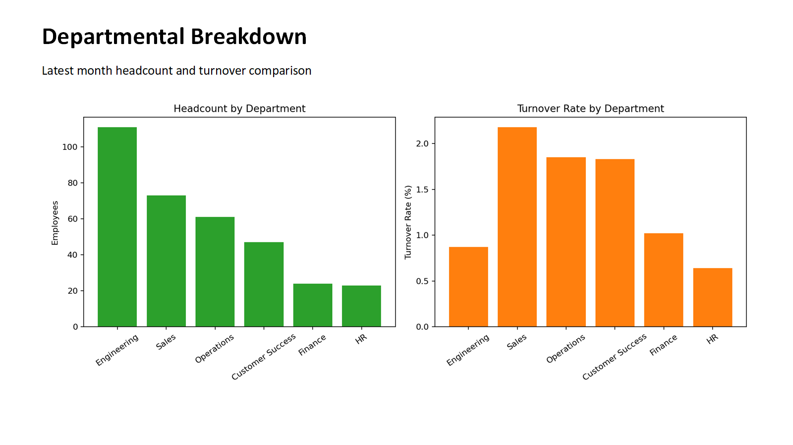

# HR Metrics Automator

**Project:** `hr-metrics-automator`  
**Purpose:** Automate HR KPI reporting from monthly operational metrics into an executive-ready PowerPoint deck.

---

## Overview

This project simulates a production-style HR dashboard automation workflow:

1. Generates realistic monthly HR metrics (12 months: **Feb 2025 – Jan 2026**)
2. Calculates trend insights and month-over-month changes
3. Produces a polished **5-slide executive PowerPoint** report
4. Outputs supporting visualizations and summary text for fast stakeholder review

Designed as a portfolio artifact for **HR Analytics / HRIS / People Ops** roles.

## Professional Project Description

**HR Metrics Automator** is an executive reporting automation solution for People Operations teams that need fast, consistent, and decision-ready workforce insights.

Instead of manually pulling metrics into slide decks each month, this project automates the full reporting pipeline: data generation/ingestion, KPI analysis, charting, executive summary writing, and PowerPoint delivery. The result is a repeatable reporting process that improves leadership visibility into hiring health, retention risk, and department-level workforce dynamics.

### Business Value Highlights

- **Reduces reporting cycle time** from hours to minutes with one-command automation
- **Improves decision quality** by surfacing month-over-month trend shifts and department risk signals
- **Standardizes executive communication** with a consistent 5-slide narrative format
- **Scales easily** from mock data to real HRIS/LMS exports with minimal code changes

---

## Metrics Included

- Headcount
- New hires
- Terminations
- Open positions
- Time-to-fill (days)
- Offer acceptance rate (%)
- Turnover rate (%)
- Department-level breakdowns

Departments:
- Engineering
- Sales
- Operations
- HR
- Finance
- Customer Success

---

## Project Structure

```text
hr-metrics-automator/
├── data/
│   └── hr_metrics_monthly.csv
├── output/
│   ├── hr_metrics_executive_dashboard.pptx
│   ├── executive_summary.txt
│   ├── headcount_trend.png
│   ├── hiring_turnover_trend.png
│   └── department_breakdown.png
├── src/
│   ├── generate_mock_data.py
│   └── build_dashboard_report.py
├── assets/
│   └── screenshots/
├── requirements.txt
└── README.md
```

---

## How to Run

### 1) Install dependencies

```bash
pip install -r requirements.txt
```

### 2) Generate mock data

```bash
python src/generate_mock_data.py
```

### 3) Build the executive dashboard report

```bash
python src/build_dashboard_report.py
```

---

## Output (Automated)

- `output/hr_metrics_executive_dashboard.pptx`
  - Slide 1: Title + executive summary
  - Slide 2: Headcount trends
  - Slide 3: Hiring metrics (new hires + turnover)
  - Slide 4: Departmental breakdown
  - Slide 5: Key insights and recommendations

- `output/executive_summary.txt`
- `output/*.png` visualization assets

---

## Sample Output

Below are sample slide screenshots generated by the automation pipeline:

### Slide 2 — Headcount Trends



### Slide 3 — Hiring Metrics



### Slide 4 — Departmental Breakdown



### Generated Executive Deliverables

- `output/hr_metrics_executive_dashboard.pptx`
- `output/executive_summary.txt`

---

## Business Value

This automation reduces manual reporting effort and standardizes executive HR review:

- **Faster reporting cycle:** Minutes instead of hours
- **Consistency:** Standard KPIs and visuals every month
- **Decision support:** Highlights trend inflections and departmental risk areas
- **Scalability:** Can be adapted to real HRIS/LMS exports with minimal code changes

---

## Portfolio Notes

This project demonstrates:

- Data generation and transformation with **pandas**
- KPI trend analysis and month-over-month logic
- Programmatic executive storytelling in **PowerPoint**
- Clean project structure and reproducible automation
